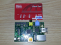
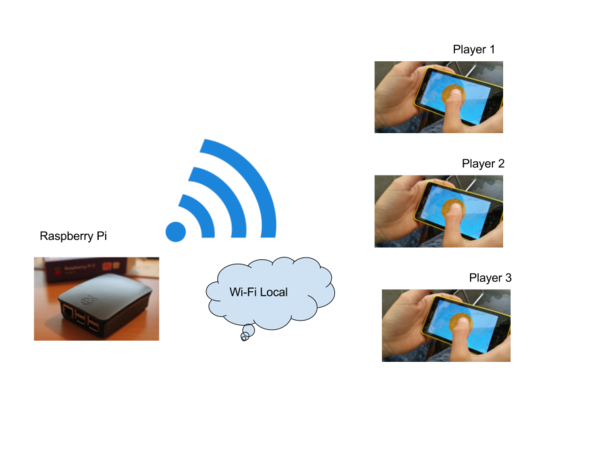

<meta charset="utf-8" /> 

# Cyborg

Cyborg (le nom est à débattre) est une plateforme de jeux de sociétés dont les supports sont les smartphones (ou tablettes ou PC) et un point d'accès Wi-Fi / Serveur Web , léger (ex Raspberry Pi).

(Le raspberry pi est un petit ordinateur à bas prix)

Pour jouer, les utilisateurs doivent connecter leur smartphone au réseau Wi-Fi émis par le raspberry Pi puis lancer leur navigateur web.
L'installation d'une application tierce et la connection à internet n'est pas nécessaire.

Cyborg propose un nouveau support à un nouveau type de jeux de sociétés.
Il est possible, par exemple, que les jeux utilisent les périphériques des smartphones (son,écran,appareil photos,... ) et ceux du raspberry pi (son, ecran hdmi, ports usb,...). Mais aussi des caractéristiques propres à l'informatique (Temps réel, capacité de stockage et de calcul). On est à la frontière entre le jeu de société et le jeu vidéos.

Cyborg a pour objectif de :
 - Permettre une nouvelle forme d'utilisation aux smartphones.
 - Faire disparaitre l'aspect asocial lors de l'utilsation d'un smartphone.

 Il sera possible de jouer au jeux Cyborg comme on le ferai avec un jeu de société (encore faut-il une prise electrique). Mais aussi dans des lieux publiques (Métro, commerces, salles d'attentes). Pourvu que les joueurs disposent d'un ou plusieur smartphones.

Des utilisateurs de Cyborgs qui s'amusent :)

## Matériel:

### Obligatoires

- Raspberry Pi (Serveur)
- Plusieurs terminaux type smartphones/tablettes/PC (avec navigateurs web)

### Options:
- Une enceinte (entrée jack)
- Un écran (hdmi)

## Exemple de jeu: **Donjon et Cyborgs**

(Le nom est à débattre, le scénario et en cours d'écriture)

Le jeu se déroule dans un univers fantastique futuristique. C'est un jeu multijoueur avec un maître du jeu qui est lui aussi un joueur.

On peut distiguer deux camps. L'équipe et le maitre du jeu. Ces deux camps s'oppose et seul l'un des deux camps gagne.

C'est un mix entre Donjon et Dragons et Le livre dont vous êtes le héros.

Le but de l'équipe est d'arriver à finir une quête alors que le maitre du jeu doit compter l'histoire suivant une trame qui lui est proposé et faire en sorte que l'équipe perdent (meurt) avant la fin de sa quête.

L'équipe évolue dans des salles et est confrontée à différentes aventures sous différentes forme:
- Enigme choix multiples
- Combat
- Mini jeu

Le maître du jeu peu réussir à convertir des menbres de l'équipe sans que les autres joueurs ne soit au courant. Les menbres de l'équipe peuvent possédés des propriétés/objets qui sont cachés au maitre du jeu.

**Il est important qu'il y est un maximum d'échange hors smartphone pour garder l'aspect social du jeu (=> Evité le smartphone zombies)**

